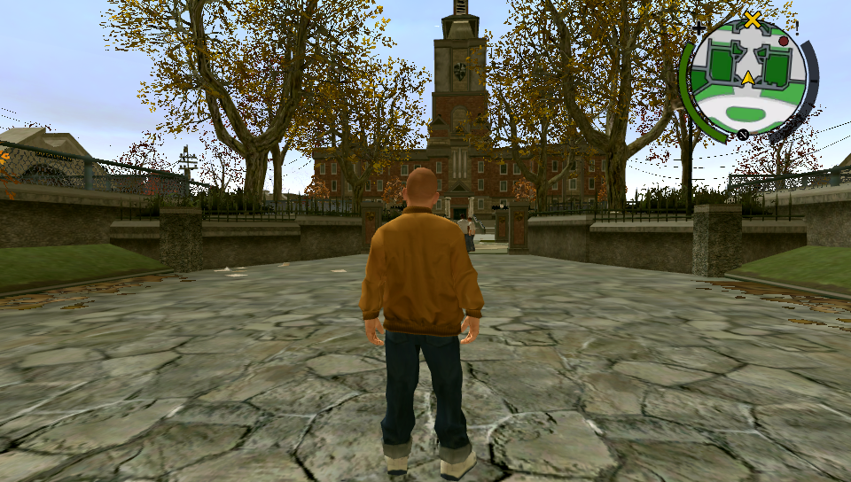

# Bully: Anniversary Edition Vita

<p align="center"></p>

This is a wrapper/port of *Bully: Anniversary Edition* for the *PS Vita*.

The port works by loading the official Android ARMv7 executable in memory, resolving its imports with native functions and patching it in order to properly run.

## Setup Instructions (For End Users)

(If you have already installed the game and want to update to a newer release, you can simply install [Bully.vpk](https://github.com/TheOfficialFloW/bully_vita/releases/download/v1.0/Bully.vpk) on your *PS Vita*).

In order to properly install the game, you'll have to follow these steps precisely:

- Install [kubridge](https://github.com/TheOfficialFloW/kubridge/releases/) and [FdFix](https://github.com/TheOfficialFloW/FdFix/releases/) by copying `kubridge.skprx` and `fd_fix.skprx` to your taiHEN plugins folder (usually `ux0:tai`) and adding two entries to your `config.txt` under `*KERNEL`:
  
```
  *KERNEL
  ux0:tai/kubridge.skprx
  ux0:tai/fd_fix.skprx
```

**Note** Don't install fd_fix.skprx if you're using repatch plugin

- **Optional**: Install [PSVshell](https://github.com/Electry/PSVshell/releases) to overclock your device to 500Mhz.
- **Optional**: Install [CapUnlocker](https://github.com/GrapheneCt/CapUnlocker/releases) to use the 4th core.
- Obtain your copy of *Bully: Anniversary Edition* legally for Android in form of an `.apk` file and one or more `.obb` files (usually `main.11.com.rockstargames.bully.obb` and `patch.11.com.rockstargames.bully.obb` located inside the `/sdcard/android/obb/com.rockstargames.bully/`) folder. [You can get all the required files directly from your phone](https://stackoverflow.com/questions/11012976/how-do-i-get-the-apk-of-an-installed-app-without-root-access) or by using an apk extractor you can find in the play store. The apk can be extracted with whatever Zip extractor you prefer (eg: WinZip, WinRar, etc...) since apk is basically a zip file. You can rename `.apk` to `.zip` to open them with your default zip extractor.
- Open the apk with your zip explorer, extract the `assets` folder from your `.apk` file to `ux0:data` and rename it to `Bully`. The result would be `ux0:data/Bully/`
- Still in the apk, extract the file `libBully.so` from the `lib/armeabi-v7a` folder to `ux0:data/Bully`. 
- Create the folder `ux0:data/Bully/Android`, copy and paste (do not extract!) `main.11.com.rockstargames.bully.obb` to `ux0:data/Bully/Android/main.11.com.rockstargames.bully.obb` and `patch.11.com.rockstargames.bully.obb` to `ux0:data/Bully/Android/patch.11.com.rockstargames.bully.obb` and finally rename them to to `ux0:data/Bully/Android/main.obb` and `ux0:data/Bully/Android/patch.obb`.
- Download the [gamefiles.zip](https://github.com/TheOfficialFloW/bully_vita/releases/download/v1.0/gamefiles.zip) and extract the contents to `ux0:data/Bully`.
- Install [Bully.vpk](https://github.com/TheOfficialFloW/bully_vita/releases/download/v1.0/Bully.vpk) on your *PS Vita* and enjoy the game. Note that for the first boot, the game may take around 3min to generate `.idx` files for the `.obb` files. Make sure that your device does not go to sleep in that time. After the first boot, the game should take around 1min to start.
- Once in game, press START to open the pause menu, then go to Settings and change "Clarity" to "High" for native resolution.

## Notice

- The official game does not free unused textures (as modern smartphones have more RAM than the PS Vita) and as such, the game will crash after a long gameplay.
- If the game crashes, and there are files available in `ux0:data/Bully/glsl`, please send them to us. If there are too many, then it is because you forgot to install `gamefiles.zip`, in which case do not send us the files.

## Build Instructions (For Developers)

In order to build the loader, you'll need a [vitasdk](https://github.com/vitasdk) build fully compiled with softfp usage.  
You can find a precompiled version here: https://github.com/vitasdk/buildscripts/actions/runs/1102643776.  
Additionally, you'll need these libraries to be compiled as well with `-mfloat-abi=softfp` added to their CFLAGS:

- [mpg123](http://www.mpg123.de/download/mpg123-1.25.10.tar.bz2)

  - Apply [mpg123.patch](https://github.com/vitasdk/packages/blob/master/mpg123/mpg123.patch) using `patch -Np0 -i mpg123.patch`.

  - ```bash
    autoreconf -fi
    CFLAGS="-DPSP2 -mfloat-abi=softfp" ./configure --host=arm-vita-eabi --prefix=$VITASDK/arm-vita-eabi --disable-shared --enable-static --enable-fifo=no --enable-ipv6=no --enable-network=no --enable-int-quality=no --with-cpu=neon --with-default-audio=dummy --with-optimization=3
    make install
    ```

- [openal-soft](https://github.com/isage/openal-soft/tree/vita-1.19.1)

  - ```bash
    cd build
    cmake -DCMAKE_TOOLCHAIN_FILE=${VITASDK}/share/vita.toolchain.cmake -DCMAKE_BUILD_TYPE=Release -DCMAKE_C_FLAGS=-mfloat-abi=softfp .. && make install
    ```

- [libmathneon](https://github.com/Rinnegatamante/math-neon)

  - ```bash
    make install
    ```

- [vitaShaRK](https://github.com/Rinnegatamante/vitaShaRK)

  - ```bash
    make install
    ```

- [imgui-vita](https://github.com/Rinnegatamante/imgui-vita)

  - ```bash
    make install
    ```

- [kubridge](https://github.com/TheOfficialFloW/kubridge)

  - ```bash
    mkdir build && cd build
    cmake .. && make install
    ```

- [vitaGL](https://github.com/Rinnegatamante/vitaGL)

  - ````bash
    make SOFTFP_ABI=1 UNPURE_TEXTURES=1 PHYCONT_ON_DEMAND=1 install
    ````

Finally, in the folder of `bully_vita`, install SceLibc stubs using:

```bash
make -C libc_bridge install
```

After all these requirements are met, you can compile the loader with the following commands:

```bash
mkdir build && cd build
cmake .. && make
```

## Credits

- Rinnegatamante for porting the renderer using vitaGL and making various improvements to the port.
- Freakler for providing LiveArea assets.
- frangarcj, fgsfds and Bythos for graphics-related stuff.
- isage for the native audio backend for OpenAL-Soft.
- VictorPines for PlayStation buttons and m1s3ry for shrinking and centering them.
- Samilop Iter for betatesting.
